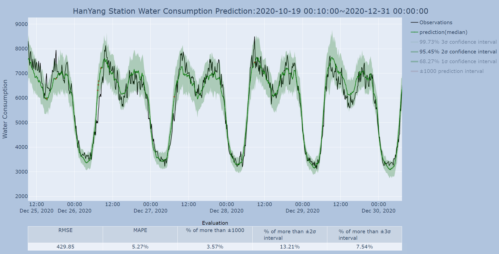

# Long-term-probability-prediction-platform-of-urban-water-consumption
A water consumption probability prediction model based on a deep autoregressive model


<br\>

## Description
 **Abstraction**: Urban water supply service is one of the critical functions of urban infrastructure. Accurate prediction of water consumption in the future is helpful in detecting the abnormalities of water supply systems, such as pipe bursts, and effectively improves the economy and stability of the water supply system. Based on two water consumption datasets, the paper finds that the Recurrent Neural Networks model represented by the GRU model outperforms other artificial neural network models when conducting the value prediction of water consumption. The root mean square error of the GRU model is only 80% of the basic model’s error. Besides, the paper develops a probabilistic water consumption model based on the Deep Auto-Regression (DeepAR) model, whose mean absolute percentage error on the test set is only 6%, which can be used in the pipe bursts alarming. ([Report](https://github.com/J-i-n-p-u/Long-term-probability-prediction-platform-of-urban-water-consumption/blob/main/Real_time_Water_Consumption_Prediction.pdf))


**Keywords: Water Consumption, Seq to Seq, RNN, Probabilistic Prediction, DeepAR**

## Installation
The project was implemented with python 3.9

```bash
pip install -r requirements.txt
```
